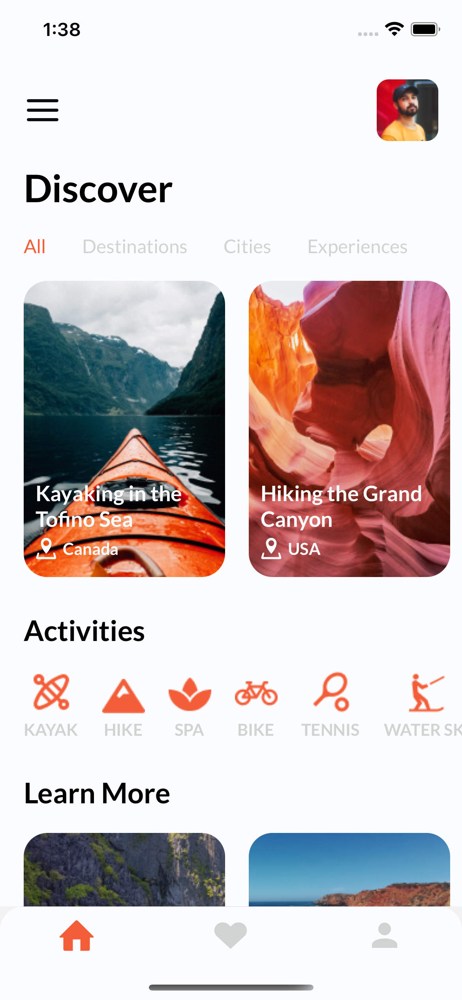
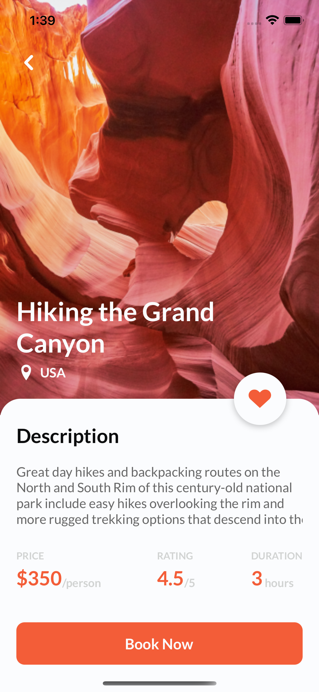

# TravelApp

(in progress)

* [General info](#general-info)
* [Screens](#screen)
* [Technologies](#technologies)
* [Setup](#setup)

## General info
This project is a simple React Native - Travel App

(description)
## Screens



## Technologies
Project is created with:
* React Native 0.68.2

	
## Setup
To run this project, install it locally using npm:

```
$ git clone (repo)
$ npm install
$ npx react-native run-ios/android
```